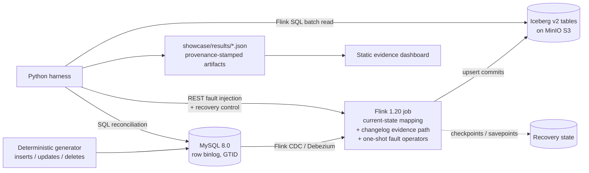

[English](README.md) | [简体中文](README.zh-CN.md)

# Streaming Reliability Lab — MySQL CDC → Flink → Iceberg

[](https://github.com/LucisZhang/streaming-reliability-lab/actions/workflows/ci.yml)

A single-node **reliability lab** for a real-time data pipeline:
`MySQL CDC → Flink 1.20 → Apache Iceberg v2 (upsert)`.

A streaming demo that works on the happy path proves nothing about exactly-once delivery.
Real failures happen around task processes, checkpoints, coordinators, savepoints, and sink
commits — so this lab **induces those failures on purpose** and then asks a narrow, checkable
question: after this specific failure and recovery path, do the MySQL source snapshot, the
Iceberg table snapshot, and the changelog event-ID sets still agree, row by row? Every claim
is backed by a committed, machine-checkable JSON artifact with full provenance (`run_id`,
`git_sha`, exact command, logs).

## Architecture



## Verified claims

Claims are **gated**: a claim is added to
[`docs/resume-claims-after-verification.md`](docs/resume-claims-after-verification.md)
only after the phase that proves it has passed and produced auditable JSON under
[`showcase/results/`](showcase/results/).

| Claim | Evidence |
| --- | --- |
| Exactly-once final-state reconciliation across **five induced failure classes** — task crash, retained-checkpoint restore, JobManager restart, savepoint restore, and a deterministic checkpoint-complete sink-commit fault — with **zero snapshot diff and consistent event-ID audits** in every class. | [`showcase/results/eo_reconciliation.json`](showcase/results/eo_reconciliation.json) (run `20260711T035242Z-b518d211`), incident log in [`RUNBOOK.md`](RUNBOOK.md) |
| CDC correctness smoke: source-vs-Iceberg final-state parity including updates and deletes, changelog audit counts, and equality-delete file metadata evidence. | [`showcase/results/phase-1.2-cdc-smoke.json`](showcase/results/phase-1.2-cdc-smoke.json) |
| Iceberg small-file maintenance: `rewrite_data_files` + manifest rewrite compacted **48 data files to 2**, cut planned scan tasks 48 → 2, raised median file size 2,809 → 6,614.5 bytes, and lowered measured `planFiles()` latency 54.92 ms → 44.57 ms across seven repetitions. | [`showcase/results/iceberg_small_file_rewrite.json`](showcase/results/iceberg_small_file_rewrite.json), chart in [`showcase/media/`](showcase/media/) |
| Checkpoint behavior under load: real Prometheus-reporter metrics show max checkpoint duration rising **55 ms → 19,022 ms** under a deterministic input spike, max alignment time ~5 ms → 16,882 ms, one recorded checkpoint failure, backpressure appearing, and Iceberg commit lag growing to **320 events and recovering to zero**. | [`showcase/results/checkpoint_metrics.json`](showcase/results/checkpoint_metrics.json), chart in [`showcase/media/`](showcase/media/) |

**Scale honesty.** This is a correctness lab, not a throughput benchmark. Each visible failure
result is intentionally tiny — three final rows, nine changelog rows, six distinct expected
event IDs — so a diff is exhaustively checkable. The recorded heavy run executed on Apple
Silicon macOS (16 GiB host RAM; the Docker VM reported 10 CPUs and ~7.65 GiB). There is no
production-throughput, terabyte-table, long-duration, or cross-cloud result, and no claim of
one.

## How the evidence works

- **Correctness-safe reading.** Iceberg v2 upsert tables contain equality deletes; pyiceberg
  is not a correctness reader for them. The lab splits the paths: `make sql-iceberg` reads
  data through **Flink SQL batch**; `make sql-iceberg-meta` uses pyiceberg for **metadata
  only** (files, manifests, snapshots).
- **Results contract.** Every artifact must carry `run_id`, `git_sha`, `started_at`,
  `finished_at`, `stack_versions`, `command`, and `logs`
  ([contract](showcase/results/README.md)); the dashboard sync step validates this before an
  artifact is publishable.
- **Incident log.** [`RUNBOOK.md`](RUNBOOK.md) records each induced failure as an incident:
  trigger, observed symptom, detection/recovery commands, validation, artifact links.

## Evidence dashboard (deployable slice)

The heavy pipeline is not a public live demo. The deployable slice is a **static dashboard**
([`dashboard/`](dashboard/)) built over the exported result JSON — it renders the artifacts
and their provenance and calls no backend.

```bash
make dashboard-build     # validates results contract, then vite build
make dashboard-preview   # serve the built dashboard locally
```

## Local lite mode

On a space-constrained laptop, use the no-Docker path:

```bash
make local-verify
```

This runs harness unit tests, lint/type checks, Maven verification, and the static dashboard
build with results-contract validation. It is the recommended local command for reviewing the
project. It does **not** reproduce the live Flink/MySQL/Iceberg failure run on demand.

## Heavy reproduction path

Pinned toolchain: Java 11 (Temurin), Maven 3.9, Python 3.11, Node 20
(see [`docs/version-matrix.md`](docs/version-matrix.md) and `.tool-versions`).
Stack: Flink 1.20.4 + Flink CDC 3.6.0, Iceberg 1.10.0, MySQL 8.0.36 (row binlog, GTID, full
row images), MinIO, PyIceberg 0.9.1.

```bash
make doctor                                   # toolchain / env preflight
make preflight-heavy                          # disk + Docker responsiveness guard
make up-core                                  # MySQL + Flink JM/TM + MinIO + Iceberg JDBC catalog
make gen ARGS="--events 10000 --seed 1"       # deterministic source generator
make sql-mysql Q="SELECT COUNT(*) FROM orders"
make eo-verify ARGS="--failure all"           # induce all five failure classes and reconcile
make down                                     # remove containers and run volumes
```

The heavy path needs a workstation with ≥ 40 GiB free disk and enough Docker memory for
Flink, MySQL, MinIO, and the catalog. The Makefile refuses heavy targets below 25 GiB free or
when Docker is unresponsive. See
[`docs/local-lite-and-workstation.md`](docs/local-lite-and-workstation.md) for the full
laptop-vs-workstation split.

Lightweight checks (no Docker): `make test`, `make lint` (ruff, black, mypy, Maven verify),
`make dashboard-build`, or the combined `make local-verify`.

## CI

GitHub Actions runs the light paths on every push: Python lint + unit tests, the Flink job
Maven build, and the dashboard build with results-contract validation. The heavy Docker
integration (`make eo-verify`, `make test-cdc`) is intentionally **not** in CI — it runs
manually on a single node and its outputs are committed as auditable artifacts.

## Scope and status

- Verified through **Phase 2.3** (five-failure-class EO reconciliation, Iceberg small-file
  maintenance, checkpoint metrics under load).
- **StarRocks (M3+) has not been started** — the `olap` compose profile, serving-table
  imports, and the compaction benchmark are reserved future work.
- Single-node Docker Compose only; no cloud, no multi-node, no GPU.
- Local laptops are treated as evidence-review machines, not the default heavy reproduction
  environment. Preserve workstation evidence before making any "reproduced on demand" claim.

## Rights

No open-source license is currently granted; all rights reserved. Flink, Iceberg, Debezium,
MySQL, and MinIO retain their own upstream licenses.
