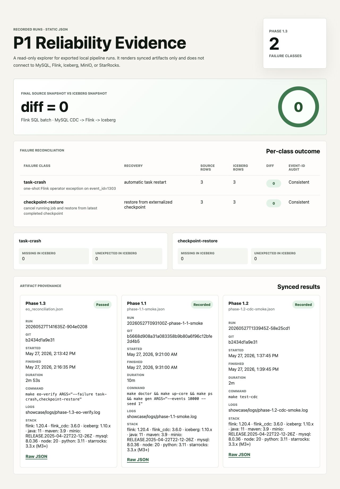

# Reliability Lab — MySQL CDC -> Flink -> Iceberg

这是一个单节点数据管道可靠性实验室。重点不是把组件连起来，而是主动制造故障，
再把最终 MySQL 源快照与 Iceberg 快照逐行对账，并检查事件 ID 集合是否一致。

## 当前已记录运行

`20260711T034018Z-local-mac`（证据提交 `7eab9c3`）是一次已记录的 Apple Silicon
macOS 运行。主机内存为 16 GiB，Docker Desktop 虚拟机报告 10 个 CPU 和约
7.65 GiB 内存。五类故障全部恢复，快照差异为零，事件 ID 审计一致。

| 故障类型 | 已记录结果 | 主要文件 |
| --- | --- | --- |
| 任务崩溃 | 通过 | [`eo_reconciliation-all.json`](docs/workstation-run/20260711T034018Z-local-mac/eo_reconciliation-all.json) |
| 检查点恢复 | 通过 | 同一 JSON 的 `results[1]` |
| JobManager 重启 | 通过 | 同一 JSON 的 `results[2]` |
| 保存点恢复 | 通过 | 同一 JSON 的 `results[3]` |
| sink 提交故障 | 通过 | 同一 JSON 的 `results[4]` |

完整命令、环境与清理记录见[运行摘要](docs/workstation-run/20260711T034018Z-local-mac/SUMMARY.md)。
这证明的是这一次已记录的运行，不代表所有硬件都兼容，也不代表任何环境都能一键复现。

## 证据如何工作

- Iceberg v2 upsert 表包含 equality delete，因此正确性对账通过 Flink SQL batch 读取；
  pyiceberg 只用于文件、manifest 和 snapshot 等元数据。
- 每个可发布 JSON 都必须包含 `run_id`、`git_sha`、时间、技术栈版本、命令和日志引用。
- `RUNBOOK.md` 按故障记录触发方式、症状、恢复命令、验证结果和文件链接。

## 本地轻量检查

空间有限的笔记本不启动 Docker，只运行：

```bash
make local-verify
```

它会执行 harness 单元测试、lint/type check、Maven 验证和静态证据面板构建，
但不会现场重跑 MySQL/Flink/Iceberg 的完整故障链路。

## 重型复现

需要至少 40 GiB 可用磁盘，以及足够的 Docker 内存：

```bash
make doctor
make preflight-heavy
make up-core
make gen ARGS="--events 10000 --seed 1"
make eo-verify ARGS="--failure all"
make down
```

固定工具链为 Java 11、Maven 3.9、Python 3.11 和 Node 20。具体要求见
[`docs/local-lite-and-workstation.md`](docs/local-lite-and-workstation.md)。

## 已记录画面



可在 [Portfolio Phase 2 Review](https://portfolio-site-phase2-review.vercel.app/engineering/p1-reliability-lab)
查看交互式回放。外部审阅者所需的 Vercel Shareable Link 参数单独提供，不写入本仓库。

## 范围

- 已验证到 Phase 2.3：五类故障恢复对账、Iceberg 小文件维护和负载下的 checkpoint 指标。
- StarRocks 尚未开始。
- 仅为单节点 Docker Compose，不是云端、多节点或 GPU 系统。
- GitHub Actions 只运行轻量检查；重型 Docker 集成由人工执行并保存可审计文件。
