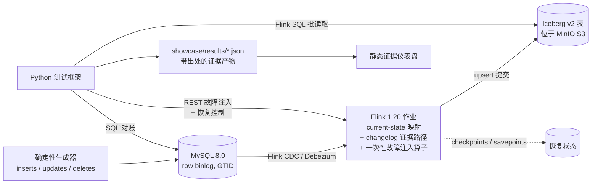

[English](README.md) | [简体中文](README.zh-CN.md)

# 流式可靠性实验室 — MySQL CDC → Flink → Iceberg

[](https://github.com/LucisZhang/streaming-reliability-lab/actions/workflows/ci.yml)

这是一个单节点的**可靠性实验室**，面向一条实时数据管道：
`MySQL CDC → Flink 1.20 → Apache Iceberg v2（upsert）`。

一个只在顺利路径（happy path）上能跑通的流式演示，无法证明任何关于精确一次（exactly-once）投递的结论。
真实的故障发生在任务进程、检查点（checkpoint）、协调器（coordinator）、保存点（savepoint）和 Sink 提交附近——因此本实验室**有意注入这些故障**，然后提出一个狭窄且可检验的问题：在这次特定的故障与恢复路径之后，MySQL 源端快照、Iceberg 表快照以及 changelog 事件 ID 集合是否仍然逐行一致？每一项声明都由一个已提交的、可机器校验的 JSON 证据产物支撑，并带有完整出处信息（`run_id`、`git_sha`、确切命令、日志）。

## 架构



## 已验证的声明

声明是**门禁式（gated）**的：只有当证明某项声明的阶段通过、并在
[`showcase/results/`](showcase/results/) 下产出可审计的 JSON 之后，该声明才会被加入
[`docs/resume-claims-after-verification.md`](docs/resume-claims-after-verification.md)。

| 声明 | 证据 |
| --- | --- |
| 跨**五类受控注入故障**的精确一次最终状态对账——任务崩溃、保留检查点（retained checkpoint）恢复、JobManager 重启、保存点恢复，以及一个确定性的检查点完成时 Sink 提交故障——在每一类中均实现**零快照差异与一致的事件 ID 审计**。 | [`showcase/results/eo_reconciliation.json`](showcase/results/eo_reconciliation.json)（运行 `20260711T035242Z-b518d211`），事件记录见 [`RUNBOOK.md`](RUNBOOK.md) |
| CDC 正确性冒烟测试：源端与 Iceberg 最终状态一致（含更新与删除）、changelog 审计计数，以及 equality-delete 文件元数据证据。 | [`showcase/results/phase-1.2-cdc-smoke.json`](showcase/results/phase-1.2-cdc-smoke.json) |
| Iceberg 小文件治理：`rewrite_data_files` + manifest 重写将 **48 个数据文件合并为 2 个**，计划扫描任务数从 48 降至 2，文件大小中位数从 2,809 提升至 6,614.5 字节，并在七次重复测量中将实测 `planFiles()` 延迟从 54.92 ms 降至 44.57 ms。 | [`showcase/results/iceberg_small_file_rewrite.json`](showcase/results/iceberg_small_file_rewrite.json)，图表见 [`showcase/media/`](showcase/media/) |
| 负载下的检查点行为：真实的 Prometheus reporter 指标显示，在确定性输入突增下，最大检查点耗时从 **55 ms 升至 19,022 ms**，最大对齐（alignment）时间从约 5 ms 升至 16,882 ms，记录到一次检查点失败，出现反压（backpressure），Iceberg 提交滞后增长至 **320 个事件并恢复至零**。 | [`showcase/results/checkpoint_metrics.json`](showcase/results/checkpoint_metrics.json)，图表见 [`showcase/media/`](showcase/media/) |

**规模诚实声明。** 这是一个正确性实验室，而不是吞吐量基准测试。每个可见的故障结果都有意保持极小——三行最终数据、九行 changelog、六个不同的预期事件 ID——以便任何差异都能被穷举式检验。已记录的重负载运行在 Apple Silicon macOS 上执行（宿主机 16 GiB 内存；Docker 虚拟机报告 10 个 CPU 和约 7.65 GiB 内存）。本项目没有生产吞吐量、TB 级大表、长时间运行或跨云的结果，也不作此类声明。

## 证据的工作方式

- **正确性安全的读取方式。** Iceberg v2 upsert 表包含 equality delete；pyiceberg 不是这类表的正确性读取器。实验室将两条路径分开：`make sql-iceberg` 通过 **Flink SQL 批模式**读取数据；`make sql-iceberg-meta` 使用 pyiceberg，且**仅用于元数据**（文件、manifest、快照）。
- **结果契约。** 每个证据产物必须携带 `run_id`、`git_sha`、`started_at`、`finished_at`、`stack_versions`、`command` 和 `logs`（见[契约](showcase/results/README.md)）；仪表盘同步步骤会在产物可发布之前校验该契约。
- **事件日志。** [`RUNBOOK.md`](RUNBOOK.md) 将每次注入的故障记录为一条事件：触发方式、观察到的症状、检测/恢复命令、验证过程、证据产物链接。

## 证据仪表盘（可部署的部分）

重负载管道不是一个公开的在线演示。可部署的部分是一个基于导出的结果 JSON 构建的**静态仪表盘**（[`dashboard/`](dashboard/)）——它渲染证据产物及其出处信息，不调用任何后端。

```bash
make dashboard-build     # 校验结果契约，然后执行 vite build
make dashboard-preview   # 在本地启动构建好的仪表盘
```

## 本地轻量模式

在磁盘空间受限的笔记本电脑上，使用无 Docker 路径：

```bash
make local-verify
```

该命令运行测试框架单元测试、lint/类型检查、Maven 验证，以及带结果契约校验的静态仪表盘构建。这是评审本项目时推荐的本地命令。它**不会**按需复现真实的 Flink/MySQL/Iceberg 故障运行。

## 重负载复现路径

锁定版本的工具链：Java 11（Temurin）、Maven 3.9、Python 3.11、Node 20
（见 [`docs/version-matrix.md`](docs/version-matrix.md) 和 `.tool-versions`）。
技术栈：Flink 1.20.4 + Flink CDC 3.6.0、Iceberg 1.10.0、MySQL 8.0.36（row binlog、GTID、完整行镜像）、MinIO、PyIceberg 0.9.1。

```bash
make doctor                                   # 工具链 / 环境预检
make preflight-heavy                          # 磁盘 + Docker 响应性守护检查
make up-core                                  # MySQL + Flink JM/TM + MinIO + Iceberg JDBC catalog
make gen ARGS="--events 10000 --seed 1"       # 确定性源端数据生成器
make sql-mysql Q="SELECT COUNT(*) FROM orders"
make eo-verify ARGS="--failure all"           # 注入全部五类故障并进行对账
make down                                     # 移除容器和运行卷
```

重负载路径需要一台可用磁盘 ≥ 40 GiB、且 Docker 内存足以运行 Flink、MySQL、MinIO 和 catalog 的工作站。当可用磁盘低于 25 GiB 或 Docker 无响应时，Makefile 会拒绝执行重负载目标。笔记本与工作站职责划分的完整说明见
[`docs/local-lite-and-workstation.md`](docs/local-lite-and-workstation.md)。

轻量检查（无需 Docker）：`make test`、`make lint`（ruff、black、mypy、Maven verify）、`make dashboard-build`，或组合命令 `make local-verify`。

## CI

GitHub Actions 在每次推送时运行轻量路径：Python lint + 单元测试、Flink 作业的 Maven 构建，以及带结果契约校验的仪表盘构建。重负载 Docker 集成（`make eo-verify`、`make test-cdc`）被有意**排除**在 CI 之外——它在单节点上手动运行，其输出作为可审计的证据产物提交入库。

## 范围与状态

- 已验证至 **Phase 2.3**（五类故障的精确一次对账、Iceberg 小文件治理、负载下的检查点指标）。
- **StarRocks（M3+）尚未启动**——`olap` compose profile、服务表导入以及合并（compaction）基准测试均为预留的未来工作。
- 仅限单节点 Docker Compose；无云端、无多节点、无 GPU。
- 本地笔记本电脑被视为证据审阅机器，而非默认的重负载复现环境。在作出任何“可按需复现”的声明之前，请先保留工作站证据。

## 权利声明

当前未授予任何开源许可证；保留所有权利。Flink、Iceberg、Debezium、MySQL 和 MinIO 各自保留其上游许可证。
